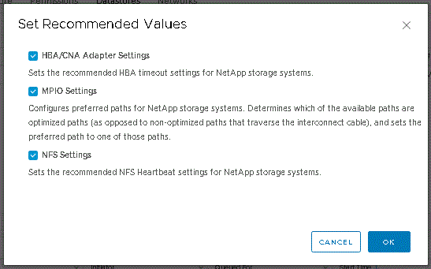

= Konfigurieren Sie Multipathing- und Zeitüberschreitungseinstellungen für ESXi-Server
:allow-uri-read: 
:icons: font
:imagesdir: ../media/

[role="lead"]
Die ONTAP Tools für VMware vSphere prüfen und legen die Multipath-Einstellungen für ESXi Hosts und die HBA-Zeitüberschreitungseinstellungen fest, die für NetApp Storage-Systeme am besten geeignet sind.

*Über diese Aufgabe*

Dieser Prozess kann je nach Konfiguration und Systemlast sehr viel Zeit in Anspruch nehmen. Der Aufgabenfortschritt wird im Fenster Letzte Aufgaben angezeigt. Wenn die Aufgaben abgeschlossen sind, wird das Symbol für die Warnung des Host-Status durch das Symbol Normal oder das Symbol Ausstehender Neustart ersetzt.

*Schritte*

. Klicken Sie auf der Startseite des VMware vSphere Web Client auf *vCenter* > *Hosts*.
. Klicken Sie mit der rechten Maustaste auf einen Host und wählen Sie dann *Aktionen* > *NetApp VSC* > *Set Empfohlene Werte* aus.
. Wählen Sie im Dialogfeld „Empfohlene Einstellungen von NetApp“ die Werte aus, die für Ihr System am besten geeignet sind.
+
Standardmäßig werden die empfohlenen Standardwerte festgelegt.

+

. Klicken Sie auf *OK*.

